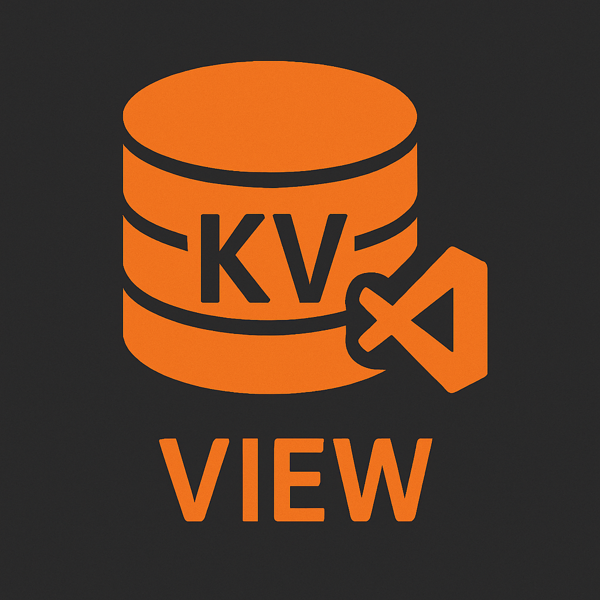

# Cloudflare KV Explorer

  
  
  **Browse and inspect Cloudflare Workers KV stores during local development with Wrangler**

## Features

- 🔍 **Live Fuzzy Search** - Search across keys and values with real-time results
- 📁 **Native VSCode Integration** - KV entries open in regular editor tabs with syntax highlighting
- 🌲 **Tree View Explorer** - Browse KV namespaces in the sidebar with hierarchical organization
- 🎨 **Automatic Formatting** - JSON content is automatically formatted for readability
- 📋 **Quick Actions** - Copy values, refresh entries, and compare different KV entries
- 🚀 **Multi-Worker Support** - Handle monorepo setups with multiple Cloudflare Workers
- ⚡ **Fast & Efficient** - Direct SQLite access for optimal performance

## Getting Started

1. Install the extension from the VSCode Marketplace
2. Open a folder containing a `wrangler.toml` file
3. Start your Wrangler development server: `wrangler dev`
4. The Cloudflare KV Explorer will appear in your Explorer sidebar
5. Click on any KV entry to view its contents

## Usage

### Browsing KV Stores
- Navigate through Workers → Namespaces → Keys in the tree view
- Click any key to open its value in a new editor tab
- JSON values are automatically formatted

### Searching
- Click the search icon (🔍) in the toolbar
- Type to search across both keys and values
- Results appear instantly with value previews
- Select a result to open it directly
- The tree filters to show only matching namespaces

### Quick Actions
- **Copy Value**: Right-click a key and select "Copy Value" 
- **Refresh Entry**: Update a single entry without refreshing the entire tree
- **Compare Entries**: Select two KV entries to view them side-by-side

## How It Works

The extension reads KV data from Wrangler's local SQLite databases located in `.wrangler/state/v3/kv/`. It automatically discovers all Workers in your workspace by finding `wrangler.toml` files and maps their KV namespace bindings to the local storage.

## Commands

- `Cloudflare KV Explorer: Search Keys` - Open the fuzzy search interface
- `Cloudflare KV Explorer: Refresh` - Reload all KV data
- `Cloudflare KV Explorer: Clear Search` - Reset search filters
- `Cloudflare KV Explorer: Compare Entries` - Compare two KV values

## Requirements

- VSCode 1.74.0 or higher
- Cloudflare Wrangler CLI installed
- Active Wrangler dev session with KV bindings

## Troubleshooting

### No KV data showing
- Ensure Wrangler dev server is running
- Check that your `wrangler.toml` has KV namespace bindings
- Verify KV data exists (add some test data if empty)

### Extension not activating
- Make sure you have a `wrangler.toml` file in your workspace
- Try manually opening the Cloudflare KV view in the Explorer sidebar

## Privacy

This extension only accesses local SQLite databases created by Wrangler. No data is sent to external servers.

## License

MIT